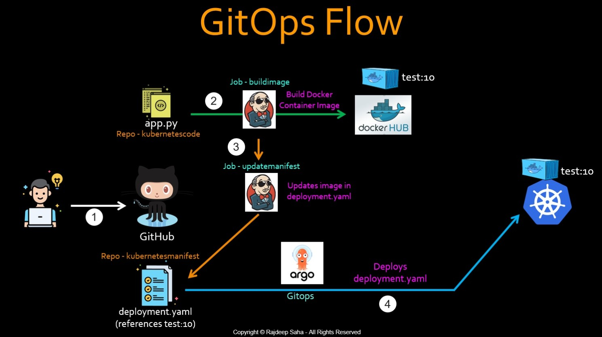

# Complete CICD pipeline for deploying a sample Flask app using Jenkins for CI, Flux for CD and Kubernetes for deployment

This repo along with [https://github.com/sudohardik/sample-app](https://github.com/sudohardik/sample-app) creates a Jenkins pipeline with GitOps to deploy code into a Kubernetes cluster(we have used minikube here). CI part is done via Jenkins and CD part via FluxCD (GitOps).

# Workflow



1. Developer pushes their code, along with the Dockerfile, to the GitHub repository. Name of the repo is CICD-with-GitOps.
2. Using GitHub webhook, a Jenkins job, named BuildImage, gets triggered automatically. This Jenkins job picks up the Dockerfile from the CICD-with-GitOps repo, and executes it in the Jenkins environment. Executing the Dockerfile builds a container image for the application program. Then, this job pushes that container image to the container registry, Dockerhub, in this case. Note the tag "10" as part of the name of the container. As the developer makes further changes to the code, the same Jenkins job will get submitted, and will create new container images with incremental tags. We will use the build number of the job as the tag.
3. We need the Kubernetes manifest file (Deployment.yaml) to reference this latest image. To do that, on the last stage of the BuildImage Jenkins job, it will submit another Jenkins job, named UpdateManifest, which will update the deployment file to refer to the latest image (sample-flask-app:10). We are using repo, sample-app, to store the manifest files. The BuildImage job, passes the tag to the UpdateManifest job using Jenkins job parameter.
4. This is where GitOps comes into play. GitOps tool, FluxCD in this case, periodically checks the GitHub repo, and reconciles with the current state of the Kubernetes cluster. As soon as the Kubernetes cluster deviates from the state defined in GitHub, FluxCD applies the changes. In this case, as soon as the image tag is updated in the deployment file, it deviates from the state in the cluster. Hence FluxCD deploys this newly updated deployment file to the cluster, and that'd spin up pods running container image "sample-flask-app:10".
5. The same process repeats itself when further changes are made to the code. As soon as code changes are pushed, job BuildImage is triggered with a new build number, builds the new container image with a newer tag, and pushes it to DockerHub. Then BuildImage job submits UpdateManifest job which updates the container image name in the deployment file. This makes GitOps detect a state difference between GitHub and running cluster (Deployment file has container image "sample-flask-app:11", and cluster is running "sample-flask-app:10). GitOps deploys the updated deployment.yaml file which brings up new pod with image "sample-flask-app:11" and terminates pods running "sample-flask-app:10". That's why in GitOps, Git becomes the single source of truth.

 Configure Dockerhub and GitHub credentials in jenkins, Note: for github credentials store the username and personal access token instead of password.

# Jenkinsfile for the BuildImage job

1. The first stage clones the repo which has the application code and Dockerfile to the Jenkins environment.
2. In the next stage, docker.build runs the Dockerfile. "sudohardik" is my DockerHub account ID, and "sample-flask-app" is the name of my repo.
3. Third stage is a dummy placeholder stage to run unit testing. As always, in the middle of all the cool things, unit testing gets ignored!
4. Next stage "Push image", as the name suggests, pushes the image to DockerHub. The word "dockerhub" is NOT a standard keyword. That is the ID under which my DockerHub credentials are stored in Jenkins, as shown in the screenshot. The ID "github" will be used by the next job.
5. On the last stage, this job triggers Jenkins job UpdateManifest, and passes the BUILD_NUMBER to a parameter named DOCKERTAG as an input to this job.

# Jenkinsfile for the UpdateManifest job

1. The first stage copies the sample-app repo to the Jenkins environment.
2. The "sed" command in the second stage replaces the container image name in the deployment.yaml file with the latest tag number received in the parameter, DOCKERTAG. Note that the "sed" command is using "+" as delimiter instead of "/" because our search and replace terms consist of "/". The sample deployment file looks like below. After changing the file, it pushes the change to the GitHub repo, using credentials saved under ID "github" in Jenkins.

# Configure flux to watch the sample app repo
```
 flux create source git flask \
     --url=https://github.com/sudohardik/sample-app.git \
     --branch=main
```
```
   flux create kustomization flask-app \
   --target-namespace=flask-app \
   --source=flask \
   --path="./" \
   --prune=true \
   --interval=30s 
```
As soon as the deployment.yaml file is changed, FluxCD grabs it and deploys it in the cluster. 

# GitHub webhook setup for triggering BuildImage job automatically on a code change

Since we are using local jenkins server so its url won't work in webhook payload url. For this we need to use a third party tool i.e webhook relay agent.
See [installation instructions](https://docs.webhookrelay.com/installation-options/installation-options/install-cli) 
To login with the CLI use token (generate it [here](https://my.webhookrelay.com/tokens)) key/secret:
```
export RELAY_KEY=
export RELAY_SECRET=
relay login -k RELAY_KEY -s RELAY_SECRET
relay forward --bucket github-jenkins http://localhost:8080/github-webhook/
```
Once you have your Input URL get back to GitHub’s webhook configuration and set it.

After the app is deployed, forward the service to access it on browser
```
minikube service lb-service -n flask-app
```

# Resources

You can find the blog post for this repository here: [https://www.linkedin.com/pulse/how-deploy-kubernetes-jenkins-gitops-github-pipeline-rajdeep-saha/](https://www.linkedin.com/pulse/how-deploy-kubernetes-jenkins-gitops-github-pipeline-rajdeep-saha/)
AND the YouTube tutorial: [https://www.youtube.com/watch?v=o4QG_kqYvHk](https://www.youtube.com/watch?v=o4QG_kqYvHk)


